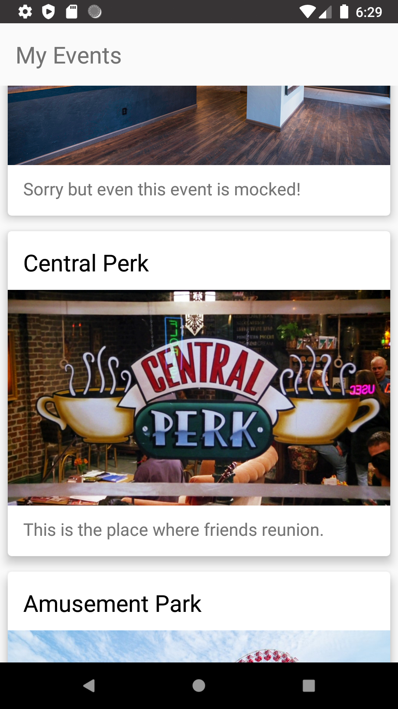
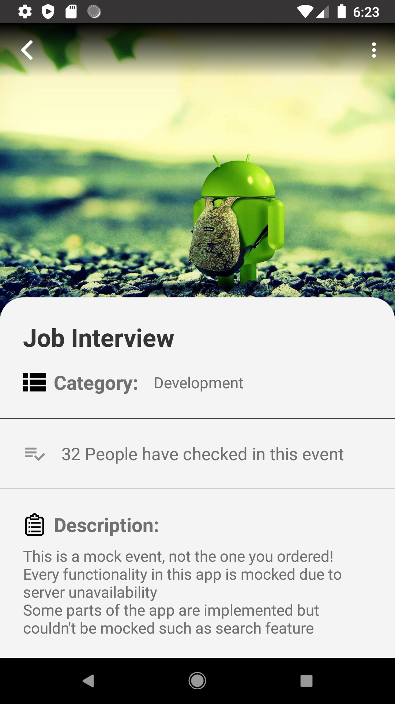

# Artout Android
Artout is a social media for sharing public art events. You can get noticed about all art related events held by other people or organization and you can also create your own events.

Artout is a social app where you can follow your friends or any event planner you like. You can notify each other about events that you are going to go in the future.

In your timeline all newly created events or events that your followings have checked in, are shown to you.

In the explore tab you can search for events or users you are looking for.

# Code
All of the featuers mentioned above were implemented in the backend(by my teammates), but because of the server unavailability and other backend related problems
I mocked some of the functionalities such as get events, get followers/followings, view event's details, view user's profile, etc.

Some features like add/edit/checkin events
are visible in the app but doesn't work(due to server problems).

Unfortunately I wasn't able to mock "search" feature and its not completely visible in the app but you can still
look at the source code and see everything.

# Screenshots
              

# Project details and Libraries
- Architecture
  - Clean Architecture (Presentation, Data, Remote)
  - MVVM for presentation layer
  - Repository pattern for data layer
- Layout
  - Material design
  - Constraint layout
  - RecyclerView
- Data Binding
- RoomDB (for local datasource)
- Retrofit (for remote datasource)
- RXJava
- Dagger2

